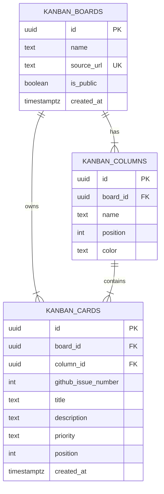

# Team 5 Kanban DB 설계

> GitHub Projects의 칸반 보드를 분석해 Supabase PostgreSQL 관계형 DB로 재구성한 데이터베이스 과제입니다.

  
  
  
  

## 1. 프로젝트 목표

기존 GitHub Project 보드에는 `Backlog`, `Ready`, `In Progress`, `Done` 열과 여러 작업 카드가 표시됩니다. 화면 정보를 한 테이블에 복사하지 않고, 반복 데이터와 관계를 분리해 보드·상태 열·작업 카드를 관리할 수 있는 DB를 설계했습니다.

- 한 보드에는 어떤 상태 열이 있는가?
- 각 카드는 어느 보드와 어느 열에 속하는가?
- 열과 카드의 표시 순서를 어떻게 유지하는가?
- 공개 페이지에서는 어디까지 조회를 허용할 것인가?

원본: [Team 5 GitHub Project](https://github.com/users/beyejin/projects/1)

## 2. 원본 데이터 분석과 정규화

| GitHub 보드에서 관찰한 정보 | DB Entity | 분리한 이유 |
| --- | --- | --- |
| Team 5 작업 보드 | `kanban_boards` | 보드 이름·원본 URL·공개 여부를 한 번만 저장 |
| Backlog / Ready / In Progress / Done | `kanban_columns` | 보드별 상태 열과 표시 순서 관리 |
| Issue 번호, 제목, 설명, 우선순위 | `kanban_cards` | 실제 작업 단위와 현재 상태 열 연결 |

초기에는 아래처럼 한 행에 저장하는 방법도 생각할 수 있습니다.

| board_name | column_name | issue_number | title | position |
| --- | --- | ---: | --- | ---: |
| Team 5 보드 | Backlog | 3 | 팀원 자기소개 내용 취합 | 0 |

그러나 보드명·열 이름이 카드 수만큼 반복되고, 열 순서가 바뀌면 여러 행을 수정해야 합니다. 그래서 Board–Column–Card 구조로 분리했습니다.

## 3. Conceptual ERD

- Board 1 : N Column — 하나의 보드는 여러 상태 열을 가집니다.
- Board 1 : N Card — 하나의 보드는 여러 작업 카드를 가집니다.
- Column 1 : N Card — 하나의 열에는 여러 카드가 놓입니다.

## 4. 테이블 구성 요소

| 테이블 | 주요 컬럼 | 역할 |
| --- | --- | --- |
| `kanban_boards` | `id`, `name`, `source_url`, `is_public` | 간반 보드의 최상위 단위 |
| `kanban_columns` | `id`, `board_id`, `name`, `position`, `color` | 보드 내부 상태 열과 열 순서 |
| `kanban_cards` | `id`, `board_id`, `column_id`, `github_issue_number`, `title`, `priority`, `position` | 작업 카드와 현재 위치 |

### `kanban_boards`

- `source_url`은 원본 GitHub Project 링크이며 `UNIQUE`입니다.
- `is_public`은 발표용 공개 보드를 판별합니다.

### `kanban_columns`

- `board_id`는 `kanban_boards.id`를 참조합니다.
- `position`은 왼쪽부터 보이는 열의 순서이며 `0 이상`만 허용합니다.
- `UNIQUE(board_id, position)`으로 같은 보드에서 열 순서가 겹치지 않게 했습니다.

### `kanban_cards`

- `column_id`는 카드의 현재 칸반 상태를 나타냅니다. 카드를 이동할 때 이 값만 변경합니다.
- `github_issue_number`는 원본 Issue 번호이며 `UNIQUE(board_id, github_issue_number)`으로 중복 저장을 막았습니다.
- `priority`는 `low`, `normal`, `high`만 허용합니다.
- `position`은 같은 열 안에서의 카드 표시 순서입니다.

## 5. 무결성 규칙

| 규칙 | 적용 방식 | 목적 |
| --- | --- | --- |
| 보드 삭제 시 하위 데이터 정리 | `ON DELETE CASCADE` | 고아 Column/Card 방지 |
| 카드 소속 관계 보장 | `board_id`, `column_id` 외래키 | 잘못된 참조 방지 |
| 열/카드 순서 음수 방지 | `CHECK (position >= 0)` | 화면 정렬 데이터 보호 |
| 우선순위 오입력 방지 | `CHECK` | 허용값만 저장 |
| Issue 중복 방지 | 복합 `UNIQUE` | 같은 카드의 중복 적재 방지 |

## 6. 샘플 데이터

실제 Team 5 보드에서 확인한 상태 열 4개와 카드 6개를 Supabase에 입력했습니다.

| 상태 열 | Issue | 작업 카드 |
| --- | ---: | --- |
| Backlog | #3 | 팀원 자기소개 내용 취합 |
| Backlog | #8 | 피드백 의견 추가 |
| Ready | #4 | 자기소개 템플릿 작성 및 팀원 안내 |
| In Progress | #2 | 팀원 소개 홈페이지 만들기 |
| Done | #1 | 팀원 소개 README 초안 |
| Done | #5 | Git 실습과 보드 관리 |

## 7. Supabase 보안 구성

세 간반 테이블은 모두 Row Level Security(RLS)를 활성화했습니다.

- `anon`, `authenticated` 역할에는 공개 보드의 `SELECT`만 허용
- 브라우저에는 공개용 anon 키만 사용
- `INSERT`, `UPDATE`, `DELETE`는 공개 페이지에서 허용하지 않음
- `service_role` 키는 저장소와 브라우저 코드에 포함하지 않음

## 8. 구현 및 검증

정적 페이지는 Supabase REST API로 `kanban_boards` → `kanban_columns` → `kanban_cards` 순서로 데이터를 조회해 렌더링합니다.

1. 원본 URL로 대상 보드를 조회합니다.
2. `position` 순서로 상태 열을 가져옵니다.
3. 카드의 `column_id`를 기준으로 해당 열에 배치합니다.
4. Supabase에서 카드 6개 조회를 확인했습니다.

## 발표용 한 문장

> GitHub 칸반 화면에서 반복되던 보드명·상태명·작업 정보를 분리해 Board–Column–Card 구조로 정규화했고, 외래키·제약조건·RLS를 적용해 실제 Supabase에서 조회 가능한 간반 DB를 구현했습니다.

상세 ERD: [docs/kanban-erd.md](docs/kanban-erd.md)
