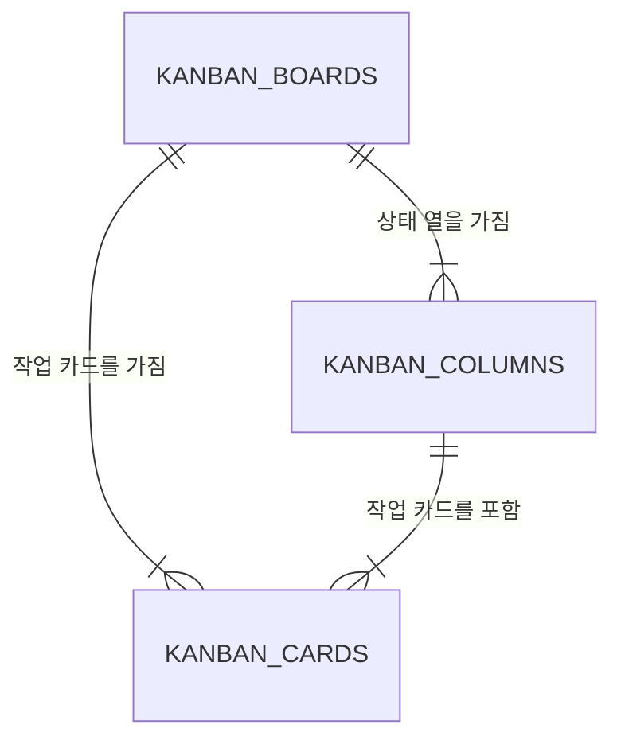

# Team 5 칸반 보드 데이터베이스

GitHub Projects의 칸반 보드를 분석해 **Supabase(PostgreSQL)** 로 재설계한 데이터베이스 프로젝트입니다.

## 한눈에 보기

| 항목 | 내용 |
| --- | --- |
| 주제 | 칸반 보드 데이터베이스 설계 |
| DBMS | Supabase / PostgreSQL |
| 핵심 테이블 | 보드, 상태 열, 작업 카드 |
| 보안 | RLS(Row Level Security) 적용 |
| 샘플 데이터 | 상태 열 4개, 작업 카드 6개 |

## 왜 이렇게 설계했나요?

칸반 보드 화면에는 보드 이름, 상태 열, 작업 카드가 함께 보입니다. 이 정보를 한 테이블에 모두 저장하면 보드명과 상태명이 카드마다 반복되고, 순서가 바뀔 때 여러 데이터를 고쳐야 합니다.

그래서 데이터를 아래 세 단위로 나누었습니다.

```text
보드 1개
 ├─ 상태 열 여러 개 (Backlog, Ready, In Progress, Done)
 └─ 작업 카드 여러 개
       └─ 각 카드는 현재 속한 상태 열을 가짐
```

## 데이터 구조

| 테이블 | 역할 | 주요 컬럼 |
| --- | --- | --- |
| `kanban_boards` | 칸반 보드 자체 | `name`, `source_url`, `is_public` |
| `kanban_columns` | 보드 안의 상태 열 | `board_id`, `name`, `position`, `color` |
| `kanban_cards` | 실제 작업 카드 | `board_id`, `column_id`, `title`, `priority`, `position` |

### 테이블 관계



- 보드 1개에는 상태 열이 여러 개 있습니다.
- 상태 열 1개에는 작업 카드가 여러 개 있습니다.
- 카드는 보드와 상태 열을 모두 참조하므로 다른 보드의 열에 잘못 들어가는 것을 막습니다.

더 자세한 ERD와 발표 설명은 [ERD 문서](docs/kanban-erd.md)에서 확인할 수 있습니다.

## 적용한 데이터 무결성 규칙

- 보드를 삭제하면 연결된 상태 열과 카드도 함께 정리됩니다. (`ON DELETE CASCADE`)
- 같은 보드 안에서 상태 열 순서가 중복되지 않습니다.
- 같은 열 안에서 카드 순서가 중복되지 않습니다.
- 카드의 우선순위는 `low`, `normal`, `high`만 저장할 수 있습니다.
- 같은 보드에는 동일한 GitHub Issue 번호를 중복 저장할 수 없습니다.

## 폴더 안내

```text
docs/
  kanban-db-project.md  # 설계 배경, 정규화, 보안 설명
  kanban-erd.md         # ERD 및 발표용 설명
supabase/
  kanban_schema.sql     # 테이블, 제약조건, RLS 정책 생성 SQL
  kanban_seed.sql       # 샘플 보드·열·카드 데이터 입력 SQL
```

## 실행 순서

1. Supabase에서 새 프로젝트를 만듭니다.
2. SQL Editor에서 `supabase/kanban_schema.sql`을 실행합니다.
3. 이어서 `supabase/kanban_seed.sql`을 실행합니다.
4. Table Editor에서 보드 1개, 상태 열 4개, 카드 6개가 생성되었는지 확인합니다.

## 팀원과 함께 사용할 때

1. 이 저장소를 내려받은 뒤 위 실행 순서대로 각자 Supabase 환경에 구성합니다.
2. 설계를 수정할 때는 `docs/`의 설명과 `supabase/`의 SQL을 함께 수정합니다.
3. SQL을 변경했다면 변경 이유와 실행 순서를 커밋 메시지에 남깁니다.
4. Supabase의 `service_role` 키는 절대 저장소에 올리지 않습니다.

## 참고 자료

- [원본 Team 5 GitHub Project](https://github.com/users/beyejin/projects/1)
- [전체 설계 문서](docs/kanban-db-project.md)
- [작업 인수인계 문서](docs/WORK_HANDOFF.md)

## 발표용 요약

> GitHub 칸반 보드에서 반복되던 보드명·상태명·작업 정보를 보드–상태 열–카드 구조로 정규화하고, 외래키·제약조건·RLS를 적용해 안전하게 조회할 수 있는 Supabase 데이터베이스를 설계했습니다.
